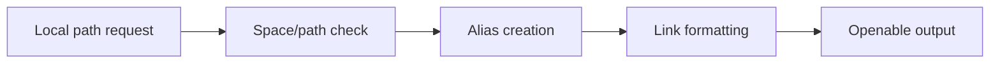

# Openable Local Path Skill

Portable utility skill for generating no-space alias paths that open reliably in Codex App local links.

## Who This Is For

| Use this when you... | Use something else when you... |
| --- | --- |
| need to return a clickable local file or folder link in Codex App | need a remote URL |
| need whitespace-safe alias paths without moving the real file | want to rename or move the real file |
| want component-by-component symlink creation with collision checks | only need a raw path inside a shell command |

## Why This Exists

- Codex App local links can fail when path segments contain spaces.
- Alias paths avoid moving the real target.
- Collision checks keep symlink creation recoverable.

## What Ships

| Component | Role |
| --- | --- |
| [`openable-local-path`](./openable-local-path) | installable Codex App skill package |
| [`openable-local-path/scripts`](./openable-local-path/scripts) | bundled helper scripts |
| [`openable-local-path/test-prompts.json`](./openable-local-path/test-prompts.json) | trigger and non-trigger examples |
| [`CHANGELOG.md`](./CHANGELOG.md) | release history |
| [`LICENSE`](./LICENSE) | license |

## Install / Use

### Codex App

- Install the skill from this repo path: `openable-local-path`
- GitHub install target:
  - repo: `Mingdao007/openable-local-path-skill`
  - path: `openable-local-path`
- Restart `Codex App` after installation so the new skill is discovered.

## Workflow

## Coverage

- whitespace-safe alias generation for local files and folders
- component-by-component symlink creation without moving the real target
- collision-aware fallback behavior when an alias cannot be created safely

## Expected Result / Verification

| Check | Expected result |
| --- | --- |
| Install target | `openable-local-path` |
| GitHub target | `Mingdao007/openable-local-path-skill` with path `openable-local-path` |
| Skill entrypoint | `openable-local-path/SKILL.md` exists |
| Trigger examples | `openable-local-path/test-prompts.json` |
| Privacy check | public package contains no private local paths or live user state |

## Trigger Examples

- `Give me a clickable local path for this file.`
- `Repair this local link that breaks because of spaces.`
- `Create a stable openable alias path in Codex App.`

## Non-Trigger Examples

- `Return a remote URL.`
- `Rename the real file on disk.`
- `Use the raw path only inside a shell command.`

## Privacy Boundary

This public repository keeps the workflow generic and reusable.

- The helper uses generic host-relative paths and does not encode personal directory names.
- The public package preserves the low-risk symlink strategy without private path assumptions.

## Repository Layout

| Path | Purpose |
| --- | --- |
| [`openable-local-path`](./openable-local-path) | installable Codex App skill package |
| [`openable-local-path/scripts`](./openable-local-path/scripts) | bundled helper scripts |
| [`openable-local-path/test-prompts.json`](./openable-local-path/test-prompts.json) | trigger and non-trigger examples |
| [`CHANGELOG.md`](./CHANGELOG.md) | release history |
| [`LICENSE`](./LICENSE) | license |

Chinese:

- [README.zh-CN.md](./README.zh-CN.md)
